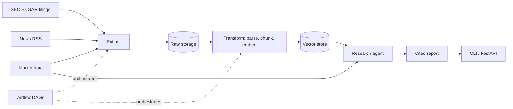

# Financial Research Agent

An agentic financial research pipeline: it extracts public financial data, transforms and indexes it, and lets an LLM agent produce cited research reports.

> Status: Day 0 scaffolding. No business logic yet. See [docs/roadmap.md](docs/roadmap.md).

## Proposed Architecture



| Layer | Package | Responsibility |
|---|---|---|
| Extract | `financial_research_agent.extract` | Pull filings, market data and news into validated raw documents |
| Transform | `financial_research_agent.transform` | Clean, chunk, embed and load into the vector store |
| Agent | `financial_research_agent.agent` | Retrieval and market tools, LLM client, agent loop, report generation |
| Orchestration | `financial_research_agent.orchestration` + `dags/` | Airflow DAGs wiring the pipeline |

## Tech Stack
Python 3.11+, Pydantic, httpx, yfinance, BeautifulSoup, tiktoken, an LLM provider SDK, a vector store, Airflow, Docker, GitHub Actions. Tooling: ruff, mypy (strict), pytest.

## Repository Layout
```
src/financial_research_agent/   Python package (one subpackage per layer)
dags/                           Airflow DAGs
infra/                          Docker and deployment files
tests/unit/                     Unit tests
tests/integration/              Integration tests
docs/                           Roadmap and one file per issue
scripts/                        Helper scripts (GitHub bootstrap)
.agents/rules/workflow.md       Living engineering rules
```

## Quickstart
```bash
make venv     # create .venv
make deps     # install dependencies (needs network)
make ci       # lint + typecheck + tests
make help     # list every target
```
Copy `.env.example` to `.env` and fill in your values before running anything that needs credentials.

## Workflow
Work is organized issue by issue with Git Flow (`main` ← `develop` ← `feature/issue-X-name`). See [.agents/rules/workflow.md](.agents/rules/workflow.md).
