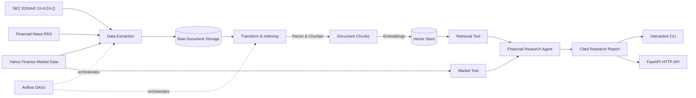

# Financial Research Agent

An autonomous, agentic financial research system: it extracts SEC filings, market data, and financial news, transforms and indexes them into a vector store, and utilizes a multi-step LLM reasoning agent with tool calling to generate structured, cited investment research reports.

---

## Architecture



### System Layers

| Layer | Subpackage | Description |
|---|---|---|
| **Extraction** | `financial_research_agent.extract` | Validated schemas (`RawDocument`), SEC EDGAR filings extractor, Yahoo Finance extractor, News RSS parser, and atomic filesystem storage writer. |
| **Transformation** | `financial_research_agent.transform` | HTML/text cleaner, recursive token-aware chunker, dense vector embeddings, vector store indexer, and metric normalizer. |
| **Agent Core** | `financial_research_agent.agent` | Domain tools (`RetrievalTool`, `MarketDataTool`), multi-provider LLM abstraction, tool-calling agent loop, structured cited report generator, and benchmark evaluation harness. |
| **Orchestration** | `financial_research_agent.orchestration` / `dags/` | Ingestion DAG (`financial_ingestion_dag`) and Transform DAG (`financial_transform_dag`) for Airflow orchestration. |
| **Delivery** | `financial_research_agent.cli` / `api` | Unified command-line interface (`financial-research-agent`) and FastAPI REST service (`GET /health`, `POST /research`, `POST /ingest`, `POST /transform`). |
| **Infrastructure** | `infra/` / `Dockerfile` / `docker-compose.yml` | Containerized runtime with non-root security, health checks, multi-service compose orchestration, and GitHub Actions CI. |

---

## Tech Stack

- **Language & Runtime**: Python 3.11+, Docker, Docker Compose
- **Data Validation & Typing**: Pydantic v2 (strict immutable schemas), mypy (strict mode)
- **Data Processing**: BeautifulSoup4, lxml, tiktoken, yfinance, feedparser, httpx
- **AI & Retrieval**: Vector search, OpenAI API, modular LLM client abstractions
- **Orchestration & Serving**: Apache Airflow DAGs, FastAPI, Uvicorn
- **Code Quality**: Ruff (linter & formatter), Pytest (unit & integration), pip-audit, Bandit

---

## Repository Layout

```
├── .github/workflows/ci.yml       # GitHub Actions CI workflow
├── .agents/rules/workflow.md      # Engineering rules and Git Flow specifications
├── dags/                          # Apache Airflow DAG definitions
│   ├── ingestion_dag.py           # Ingestion DAG
│   └── transform_dag.py           # Transformation & vector indexing DAG
├── docs/                          # Architecture roadmap and issue plans
├── infra/                         # Deployment guides and infrastructure assets
├── scripts/                       # Runnable helpers and end-to-end demo script
│   └── demo.py                    # Standalone interactive pipeline demo
├── src/financial_research_agent/  # Core package
│   ├── extract/                   # Raw schemas and data extractors
│   ├── transform/                 # Parsing, chunking, embeddings, vector store
│   ├── agent/                     # Agent loop, tools, reports, eval harness
│   ├── orchestration/             # Reusable pipeline engines
│   ├── api/                       # FastAPI application, routes, and schemas
│   └── cli.py                     # Command-line entrypoint
├── tests/                         # Test suite
│   ├── unit/                      # Unit tests
│   └── integration/               # Pipeline integration tests
├── Dockerfile                     # Multi-stage production container image
├── docker-compose.yml             # Local service orchestration
├── pyproject.toml                 # Dependencies, scripts, and tool configuration
└── Makefile                       # Self-documenting lifecycle and quality commands
```

---

## Quickstart

### 1. Prerequisites & Environment Setup

Clone the repository and initialize the Python virtual environment:

```bash
make venv
make deps      # Installs all optional dependencies and development tools
```

Configure your environment variables by copying `.env.example`:

```bash
cp .env.example .env
```

Edit `.env` to configure your API keys (optional when running in `--mock` mode):
```ini
LLM_API_KEY=your_openai_api_key
LLM_MODEL=gpt-4o
SEC_USER_AGENT="YourName your_email@example.com"
DATA_DIR=./data
LOG_LEVEL=INFO
```

### 2. Run Quality Checks

```bash
make check     # Runs ruff lint, ruff format check, and mypy in strict mode
make test      # Runs the entire pytest test suite
make ci        # Combines check and full test suite
```

---

## Running the End-to-End Demo

The repository includes a standalone demo script that exercises the full pipeline from raw document ingestion and vector transformation to cited report generation:

```bash
# Run in deterministic mock mode (no API keys required):
python scripts/demo.py --mock --ticker AAPL --query "Summarize Q3 financial results and revenue trends"

# Save generated report to file:
python scripts/demo.py --mock --ticker MSFT --output ./report.md

# Run with live OpenAI credentials (requires LLM_API_KEY in .env):
python scripts/demo.py --ticker NVDA --query "Evaluate gross margins and AI data center growth"
```

---

## Command-Line Interface (CLI)

The package installs the `financial-research-agent` command-line executable.

### 1. Research Command
Run the autonomous research agent on any ticker:
```bash
# Basic query in mock mode:
financial-research-agent research --ticker AAPL --query "What are the latest growth drivers?" --mock

# Output structured report as JSON:
financial-research-agent research --ticker MSFT --query "Summarize cloud growth" --mock --format json

# Write report to markdown file:
financial-research-agent research --ticker GOOGL --query "Analyze search revenues" --mock --output ./googl_analysis.md
```

### 2. Ingestion Command
Trigger raw data extraction across SEC, Yahoo Finance, and news sources:
```bash
financial-research-agent ingest --tickers AAPL MSFT --raw-dir ./data/raw
```

### 3. Transformation Command
Parse, chunk, embed, and index extracted documents into the vector store:
```bash
financial-research-agent transform --raw-dir ./data/raw --processed-dir ./data/processed --index-path ./data/index
```

---

## REST API (FastAPI)

Launch the REST API server locally:
```bash
uvicorn financial_research_agent.api.app:create_app --factory --host 0.0.0.0 --port 8000 --reload
```

Interactive OpenAPI documentation is available at `http://localhost:8000/docs`.

### API Endpoints

#### `GET /health`
Liveness probe returning service status and version:
```bash
curl -X GET http://localhost:8000/health
```

#### `POST /research`
Request autonomous research report generation:
```bash
curl -X POST http://localhost:8000/research \
  -H "Content-Type: application/json" \
  -d '{
    "ticker": "AAPL",
    "query": "Analyze recent quarterly revenue and profitability trends",
    "max_iterations": 5,
    "mock": true
  }'
```

#### `POST /ingest`
Trigger ingestion pipeline execution:
```bash
curl -X POST http://localhost:8000/ingest \
  -H "Content-Type: application/json" \
  -d '{
    "tickers": ["AAPL", "MSFT"],
    "raw_dir": "./data/raw"
  }'
```

#### `POST /transform`
Trigger transformation and vector indexing pipeline:
```bash
curl -X POST http://localhost:8000/transform \
  -H "Content-Type: application/json" \
  -d '{
    "raw_dir": "./data/raw",
    "processed_dir": "./data/processed",
    "index_path": "./data/index"
  }'
```

---

## Docker & Container Deployment

### 1. Build Container Image
```bash
docker build -t financial-research-agent:latest .
```

### 2. Start Services via Docker Compose
Start the FastAPI REST service in the background:
```bash
docker compose up -d
```
The service will be live at `http://localhost:8000/health`.

### 3. Run Ad-Hoc CLI Tasks with Docker Compose
Run research queries inside an isolated container:
```bash
docker compose run --rm cli research --ticker AAPL --query "What were the key risks?" --mock
```

To stop containers:
```bash
docker compose down
```

---

## Apache Airflow DAGs

The `dags/` folder contains orchestration pipelines designed for Apache Airflow:

1. **`dags/ingestion_dag.py` (`financial_ingestion_dag`)**:
   - Scheduled: Daily (`@daily`)
   - Tasks: Validates directories, extracts SEC EDGAR filings, pulls market data, and fetches news RSS feeds.
2. **`dags/transform_dag.py` (`financial_transform_dag`)**:
   - Scheduled: Daily (`@daily`)
   - Tasks: Verifies raw assets, parses and cleans filings, chunks document text, computes dense embeddings, updates the vector index, and extracts normalized financial metrics.

---

## Development & Workflow

This project adheres to **Git Flow** with strict quality gates:
- Permanent branches: `main` (production release) and `develop` (integration).
- Feature branches: `feature/issue-X-name`.
- Conventional commits: `feat`, `fix`, `refactor`, `test`, `docs`, `chore`, `ci`.
- All code requires 100% type annotations (`mypy --strict`), clean style (`ruff check` and `ruff format`), and dedicated issue test markers.
